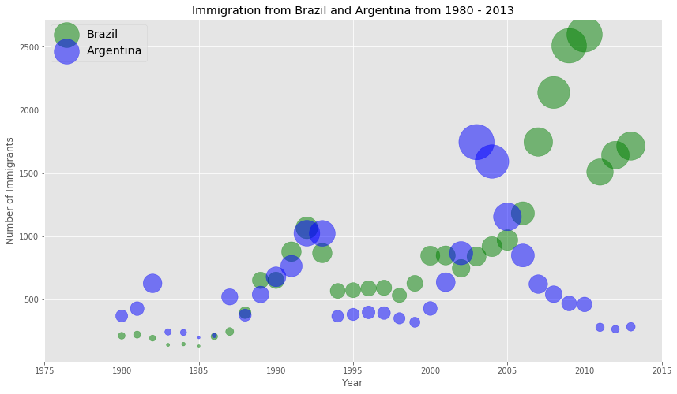

# Analysing_Impact_of_Great_Depression_of_Argentina

 

In the notebook, we'll see the effect of `Grear Depression` of `Argentina` on the immigration of `Canada` i.e. how the great depression caused lots of `Argentines` to migrate to `Canada`.

A `bubble plot` is a variation of the `scatter plot` that displays three dimensions of data (x, y, z). The datapoints are replaced with bubbles, and the size of the bubble is determined by the third variable 'z', also known as the weight. In `maplotlib`, we can pass in an array or scalar to the keywords to plot(), that contains the weight of each point.

In the notebook provided, i've also shown you how to create delicious bubble plots using `matplotlib` as shown below.

### Thanks for Reading!
